<div align="center">

# 🎙️ VoiceRAG Core v1
### Enterprise Voice RAG Platform built with Django, LangGraph & LangChain

<p>
Production-grade Voice AI Assistant implementing <b>Corrective Retrieval-Augmented Generation (CRAG)</b>, Hybrid Retrieval, Stateful Agent Orchestration, Real-time WebSockets, and Enterprise Observability.
</p>

---

[]()
[]()
[]()
[]()
[]()
[]()
[]()
[]()

<br>

[]()
[]()
[]()
[]()
[]()
[]()
[]()
[]()

</div>

---

# 📑 Table of Contents

- Executive Summary
- Why AEGIS Core?
- Key Features
- System Architecture
- Technology Stack
- Repository Structure
- Architecture Overview
- Core Components
- Design Principles

---

# Executive Summary

AEGIS Core is a **production-oriented Voice Retrieval-Augmented Generation platform** engineered around **LangGraph state machines**, **LangChain**, **Django Channels**, and **hybrid information retrieval**.

Unlike traditional chatbot implementations that simply send prompts to an LLM, AEGIS Core implements an intelligent retrieval pipeline capable of:

- retrieving relevant knowledge
- validating retrieved context
- rewriting ambiguous questions
- reranking search results
- grading document relevance
- checking hallucinations
- producing grounded responses

The project demonstrates how modern AI applications should be architected:

- deterministic orchestration
- observable execution
- modular components
- asynchronous processing
- scalable backend
- production-ready deployment

---

# Why AEGIS Core?

Modern LLM applications fail because they rely entirely on model memory.

AEGIS Core instead follows an enterprise RAG architecture.

Instead of

```
User
 ↓
LLM
 ↓
Answer
```

the system performs

```
User

↓

Speech Recognition

↓

Query Rewriting

↓

Hybrid Retrieval

↓

Cross Encoder Reranking

↓

Document Grading

↓

Context Validation

↓

Grounded Generation

↓

Hallucination Check

↓

Final Response
```

This dramatically improves

- factual correctness
- retrieval precision
- response quality
- observability
- maintainability

---

# Key Features

## 🎤 Voice First

- Real-time speech interface
- Whisper transcription
- Streaming architecture
- WebSocket communication

---

## 🧠 Stateful AI

Built using **LangGraph** instead of simple prompt chains.

Supports

- branching
- retry loops
- conditional routing
- grading nodes
- iterative refinement

---

## 📚 Hybrid Retrieval

Instead of relying solely on vector similarity,

AEGIS combines

✅ Pinecone semantic search

+

✅ BM25 lexical search

producing significantly higher recall.

---

## 🎯 Cross Encoder Reranking

Retrieved documents are reranked using a transformer Cross Encoder before entering the LLM context.

Benefits

- removes noisy chunks

- improves precision

- lowers hallucinations

---

## 🔍 Corrective RAG

Implements CRAG concepts

- query rewriting

- document grading

- retry cycles

- answer verification

instead of naive RAG.

---

## 📈 Enterprise Observability

Every node is traceable.

Supports

- LangSmith traces

- graph visualization

- execution timings

- node inspection

- debugging

---

## ⚡ Async Backend

Powered by

- Django ASGI

- Daphne

- Django Channels

allowing simultaneous

- audio streaming

- vector retrieval

- inference

without blocking.

---

# High-Level Architecture

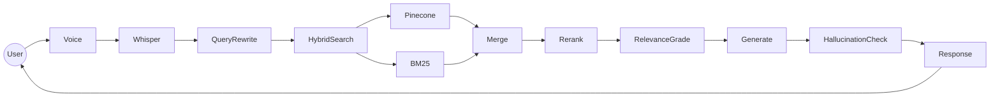

---

# Complete Processing Pipeline

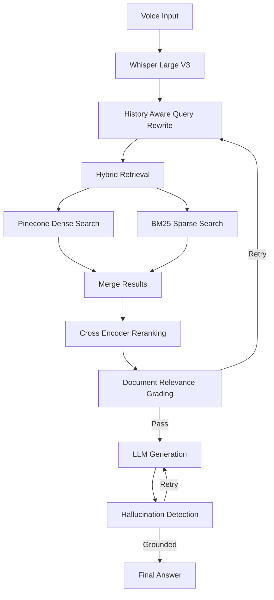

---

# Technology Stack

| Layer | Technology |
|--------|------------|
| Backend | Django 6 |
| Async Server | Daphne |
| Communication | Django Channels |
| Protocol | WebSockets |
| AI Framework | LangChain |
| Workflow Engine | LangGraph |
| Tracing | LangSmith |
| Vector Database | Pinecone |
| Sparse Retrieval | BM25 |
| Embeddings | all-MiniLM-L6-v2 |
| Reranker | Cross Encoder |
| Speech Recognition | Whisper Large V3 |
| LLM | Groq |
| Language | Python 3.12 |

---

# Repository Structure

```text
voice-rag/

├── accounts/
├── chat/
├── core/
├── graph/
├── knowledge/
├── documents/
├── all-MiniLM-L6-v2/
├── manage.py
├── requirements.txt
├── bm25_corpus.pkl
└── README.md
```

---

# Project Organization

## accounts/

Authentication and user management.

Responsible for future authentication, permissions and account-related models.

---

## chat/

Real-time communication layer.

Contains

- Django Channels consumers

- chat models

- serializers

- websocket handling

- UI template

This module acts as the gateway between frontend audio streams and backend AI orchestration.

---

## graph/

The brain of the application.

Implements

- LangGraph StateGraph

- workflow construction

- node implementations

- routing logic

- graph state

This package orchestrates the complete RAG lifecycle.

---

## knowledge/

Knowledge ingestion subsystem.

Responsible for

- document loading

- chunking

- embedding generation

- Pinecone indexing

- BM25 corpus generation

---

## documents/

Raw source documents used for ingestion.

Supports centralized knowledge management.

---

## core/

Django project configuration.

Contains

- ASGI configuration

- WSGI configuration

- routing

- settings

- environment loading

---

## all-MiniLM-L6-v2/

Locally stored Sentence Transformer model used for embedding generation.

Benefits include

- offline inference

- lower latency

- deterministic embeddings

---

## bm25_corpus.pkl

Serialized sparse index.

Allows ultra-fast keyword retrieval without rebuilding the corpus every application startup.

---

# Architectural Philosophy

AEGIS Core follows a layered architecture.

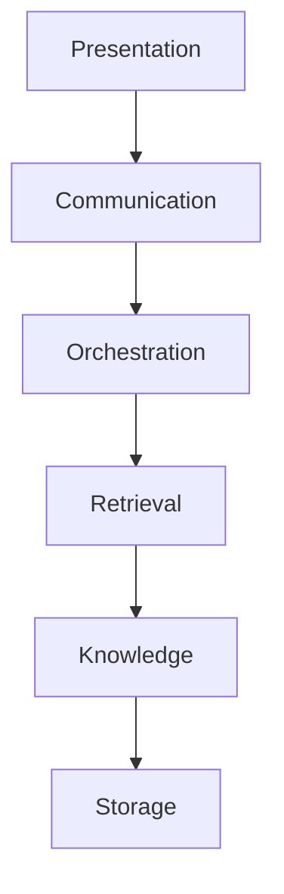

Each layer has a single responsibility.

This separation enables

- maintainability

- testability

- scalability

- observability

- extensibility

without tightly coupling AI components to Django itself.

---

# Core Design Principles

### ✅ Stateful AI

Uses graph execution instead of linear prompt chains.

---

### ✅ Retrieval Before Generation

The model answers only after verifying knowledge.

---

### ✅ Hybrid Search

Combines semantic and lexical retrieval.

---

### ✅ Production Observability

Every graph node can be traced independently.

---

### ✅ Modular Architecture

Each subsystem remains independently replaceable.

Examples include replacing

- Pinecone → Qdrant

- Groq → OpenAI

- Whisper → Deepgram

- BM25 → Elasticsearch

without redesigning the application.

---

# 🏗️ System Architecture

AEGIS Core follows a layered, domain-driven architecture where every subsystem has a clearly defined responsibility.

```text
                   Client Layer
                        │
                        ▼
            Django Channels (WebSocket)
                        │
                        ▼
              Voice Processing Layer
                        │
                        ▼
           LangGraph Orchestration Layer
                        │
       ┌────────────────┼────────────────┐
       ▼                ▼                ▼
 Retrieval Layer   Grading Layer   Generation Layer
       │                │                │
       └────────────────┼────────────────┘
                        ▼
              Pinecone + BM25 Storage
```

Unlike monolithic chatbot implementations, each layer can evolve independently.

---

# 🧩 Django Architecture

The backend is built using **Django 6** and follows the standard project/app architecture while integrating modern AI infrastructure.

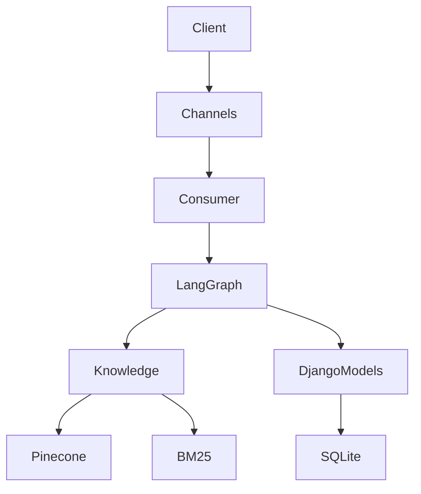

The Django project serves as more than an API backend.

It manages:

- AI orchestration
- WebSocket communication
- document management
- persistence
- administration
- configuration
- deployment

---

# Django Apps

## chat

The communication layer.

Responsibilities include

- WebSocket consumers
- incoming audio
- outgoing responses
- serialization
- conversation persistence
- frontend interaction

---

## knowledge

Knowledge management subsystem.

Responsible for

- loading documents

- parsing PDFs

- chunking text

- embedding generation

- Pinecone indexing

- BM25 generation

---

## graph

AI orchestration engine.

Contains

- StateGraph construction

- graph state

- node implementations

- routing logic

- retry conditions

---

## accounts

Authentication and future user management.

---

## core

Global Django configuration.

Includes

- ASGI

- URLs

- settings

- environment configuration

---

# 🌐 ASGI Architecture

Unlike synchronous Django deployments,

AEGIS Core runs on ASGI.

Benefits include

✅ WebSockets

✅ streaming

✅ concurrency

✅ async processing

---

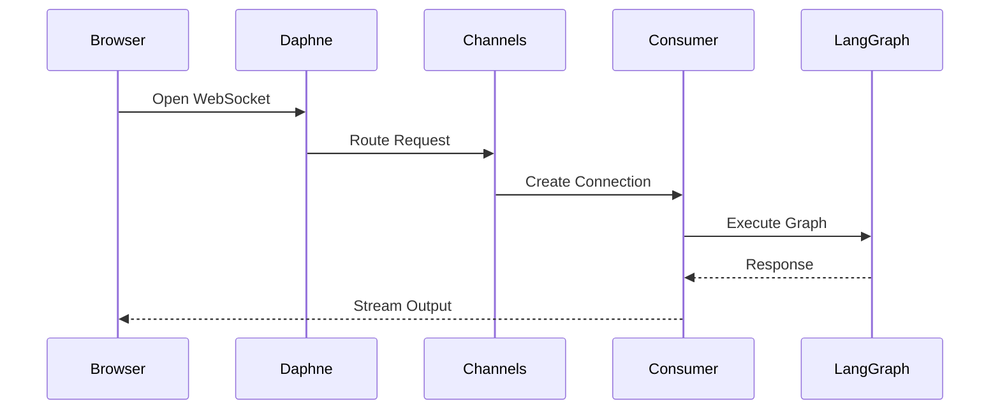

---

# Django Channels

Traditional Django

```
Request

↓

Response
```

Channels enables

```
Connection

↓

Continuous Events

↓

Bidirectional Communication

↓

Real-Time Responses
```

Perfect for

- voice assistants

- streaming audio

- live transcription

- token streaming

---

# ⚙️ LangGraph Overview

The AI workflow is orchestrated using LangGraph.

Unlike linear chains,

LangGraph provides

- branching

- loops

- retries

- state

- conditional execution

making it ideal for enterprise RAG systems.

---

## Graph Components

```
State

↓

Node

↓

Edge

↓

Conditional Edge

↓

End
```

Each node performs one responsibility.

---

# Graph Execution

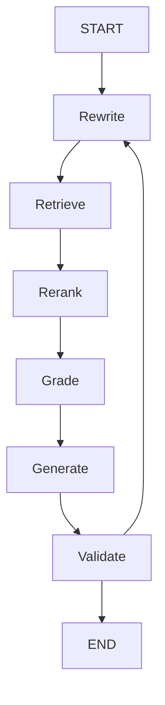

Notice the retry loop.

Instead of returning poor answers,

the graph improves retrieval.

---

# Graph State

Every execution carries a shared state.

Example

```python
state = {

question,

rewritten_question,

documents,

scores,

context,

answer,

hallucination_score

}
```

Every node receives

```
State

↓

Processing

↓

Updated State
```

This deterministic execution is significantly easier to debug than prompt chaining.

---

# LangGraph Node Responsibilities

## Query Rewrite

Improves vague or incomplete questions.

Example

```
User

"What about memory?"
```

becomes

```
"What memory architecture does the Voice RAG system use?"
```

Improves retrieval quality.

---

## Hybrid Retrieval

Retrieves candidate documents using

Dense Search

+

Sparse Search

---

## Reranker

Cross Encoder calculates

```
Question

+

Document

↓

Relevance Score
```

Only top documents survive.

---

## Relevance Grader

LLM determines

```
Relevant?

YES

or

NO
```

If NO

↓

rewrite question

↓

retrieve again

---

## Generator

Produces grounded response using verified context.

---

## Hallucination Checker

Evaluates

```
Generated Answer

↓

Supported by Context?
```

If not,

graph retries generation.

---

# 🔗 LangChain Integration

LangChain acts as the abstraction layer between the orchestration engine and AI providers.

Responsibilities include

- LLM wrappers

- Prompt templates

- Output parsers

- Embedding models

- Document loaders

- Text splitters

- Vector stores

- Chains

---

## Components Used

| Component | Purpose |
|------------|----------|
| PromptTemplate | Prompt Engineering |
| RecursiveCharacterTextSplitter | Chunking |
| Sentence Transformers | Embeddings |
| Pinecone VectorStore | Semantic Search |
| Structured Output | JSON Validation |
| Chat Model | Response Generation |

---

# 📈 LangSmith Observability

Every graph execution can be traced.
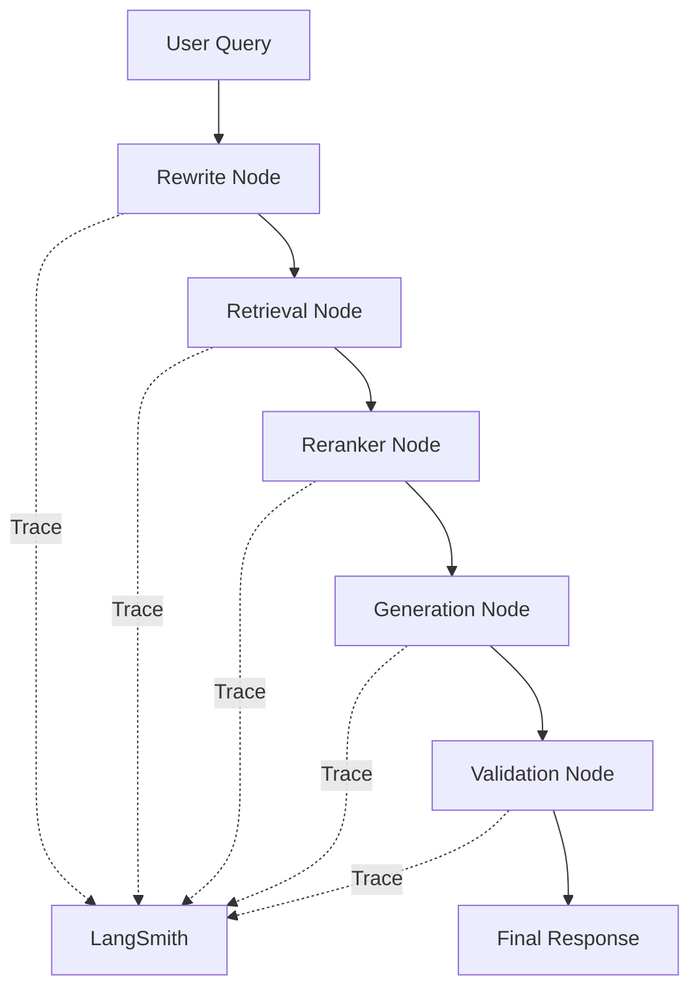

Each node records

- latency

- prompt

- output

- token usage

- errors

- execution order

Benefits include

- debugging

- optimization

- production monitoring

- prompt evaluation

---

# 🧠 Corrective RAG (CRAG)

Traditional RAG

```
Retrieve

↓

Generate

↓

Done
```

AEGIS Core

```
Retrieve

↓

Grade

↓

Rewrite

↓

Retrieve

↓

Generate

↓

Validate

↓

Retry if Needed
```

This dramatically improves answer quality.

---

# 📚 Hybrid Retrieval Pipeline

The retrieval engine combines two independent search methods.

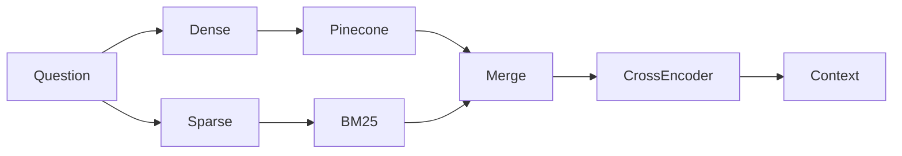

---

## Dense Retrieval

Uses embeddings generated from

```
all-MiniLM-L6-v2
```

Advantages

- semantic similarity

- conceptual matching

- synonym recognition

---

## Sparse Retrieval

Uses BM25.

Advantages

- keyword accuracy

- exact terminology

- identifiers

- filenames

- variable names

---

## Why Hybrid?

Dense search finds

```
"large language model"
```

when searching

```
"LLM"
```

Sparse search finds

```
LLM_API_KEY
```

even if embeddings miss it.

Together they maximize recall.

---

# 🎯 Cross Encoder Reranking

Initial retrieval intentionally returns more candidates.

Example

```
Top 20 Results
```

↓

Cross Encoder

↓

```
Top 5 Results
```

Only highly relevant chunks are passed to the LLM.

Benefits

- reduced hallucinations

- lower token usage

- higher precision

- improved factual grounding

---

# 📄 Knowledge Ingestion Pipeline

The ingestion subsystem transforms raw documents into searchable knowledge.

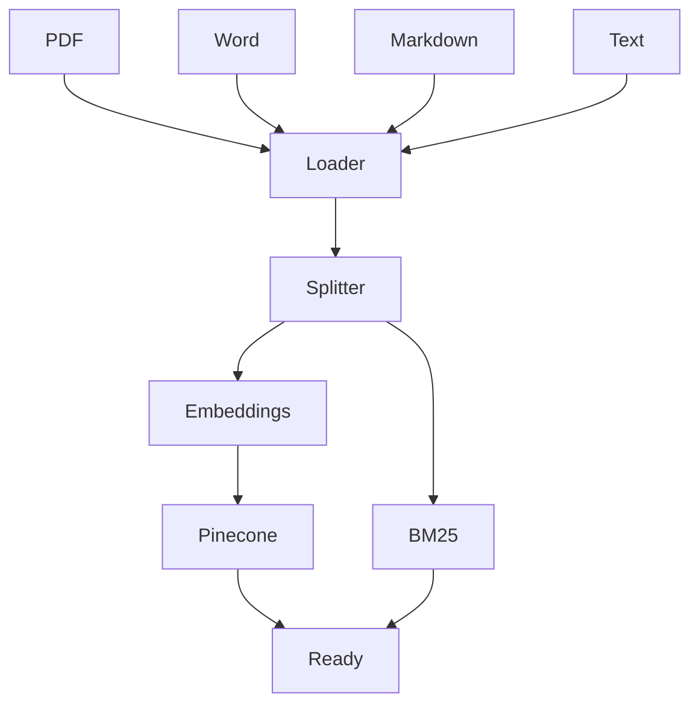

Pipeline stages

1. Load document

2. Normalize text

3. Split into chunks

4. Generate embeddings

5. Upload vectors

6. Build BM25 corpus

7. Persist indexes

---

# ✂️ Document Chunking

Documents are divided into overlapping chunks using

```
RecursiveCharacterTextSplitter
```

Goals

- preserve context

- reduce token waste

- improve retrieval precision

- maintain semantic continuity

---

# 📦 Embedding Model

The project ships with a local copy of

```
all-MiniLM-L6-v2
```

Advantages

- lightweight

- fast inference

- excellent retrieval quality

- offline support

- deterministic embeddings

---

# 🗂️ Vector Storage

Semantic vectors are stored in Pinecone.

Each vector contains

- embedding

- metadata

- source document

- chunk index

- page information

This enables precise retrieval and source attribution.

---

# 📌 Sparse Index

BM25 corpus is serialized locally.

```
bm25_corpus.pkl
```

This avoids rebuilding the sparse index every application startup, reducing initialization time.

---
---

# 🎙️ Voice Processing Pipeline

AEGIS Core is designed around a **Voice-First AI Architecture**, where spoken language is treated as the primary interaction medium instead of traditional text input.

Unlike conventional chatbots, users communicate naturally through speech while the backend orchestrates a complete AI pipeline that performs transcription, retrieval, reasoning, validation, and response generation.

---

## End-to-End Voice Lifecycle

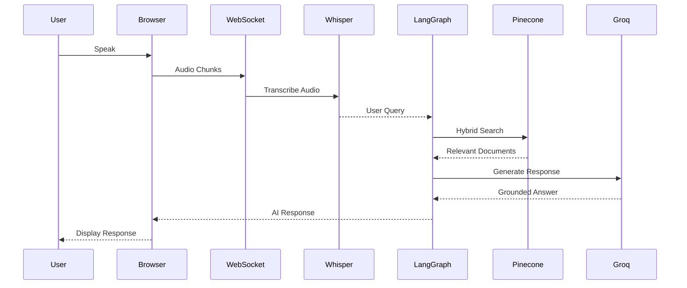

---

# Real-Time Streaming

Traditional HTTP APIs work like this:

```
Request

↓

Wait

↓

Response
```

Voice applications require a fundamentally different communication model.

```
Open Connection

↓

Continuous Audio Stream

↓

Incremental Processing

↓

Continuous Responses

↓

Connection Close
```

Persistent WebSocket connections significantly reduce latency and eliminate the overhead of repeatedly establishing HTTP connections.

---

# Django Channels

Instead of using Django's synchronous request-response lifecycle, the project leverages **Django Channels** to provide asynchronous, bidirectional communication.

Benefits include:

- Persistent WebSocket connections
- Concurrent audio processing
- Low-latency messaging
- Efficient streaming
- ASGI-native architecture
- Scalable connection management

---

## WebSocket Lifecycle

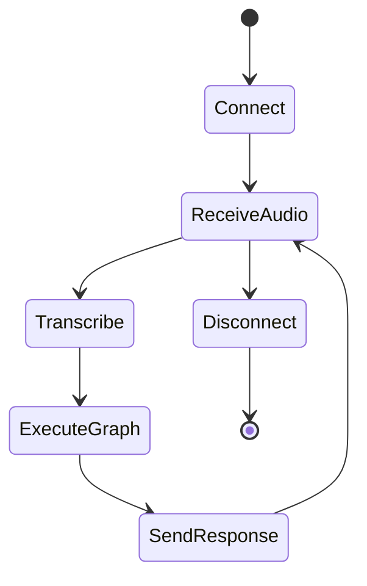

---

# Whisper Speech Recognition

Incoming audio is transcribed using **OpenAI Whisper Large V3** hosted through **Groq's inference infrastructure**.

The transcription stage converts raw speech into normalized natural language before it enters the RAG pipeline.

Responsibilities include:

- Speech-to-text conversion
- Noise tolerance
- Multilingual transcription support
- Timestamp generation
- High transcription accuracy
- Low-latency inference

---

# Query Normalization

Raw transcriptions often contain:

- filler words
- incomplete phrases
- ambiguous references
- conversational context

Example:

```
"yeah tell me about the embeddings thing"
```

becomes

```
Explain the embedding model used within this Voice RAG system.
```

This normalization significantly improves retrieval quality.

---

# Query Rewriting

The first LangGraph node rewrites ambiguous questions into retrieval-friendly queries.

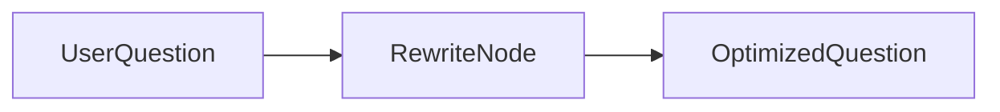

Benefits include:

- Better semantic search
- Improved BM25 matching
- Higher retrieval precision
- Context-aware reformulation

---

# Retrieval Lifecycle

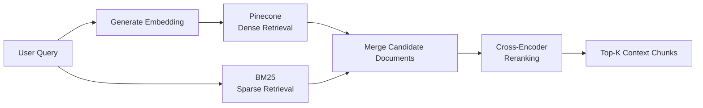

---

# Context Assembly

After reranking, the highest-quality document chunks are assembled into a single prompt context.

Each chunk contains metadata such as:

- source document
- page number
- chunk identifier
- similarity score
- retrieval source

This metadata enables future source attribution and debugging.

---

# Prompt Construction

The final LLM prompt generally consists of:

```
System Instructions

+

Retrieved Context

+

Conversation History

+

Current User Question
```

This ensures responses remain grounded in retrieved knowledge rather than relying solely on model memory.

---

# LLM Generation

The generation stage uses Groq-hosted LLMs through LangChain integrations.

Responsibilities:

- Context-aware reasoning
- Grounded response generation
- Structured output
- Deterministic formatting
- JSON validation (where applicable)

---

# Hallucination Detection

After generation, the response is validated against retrieved evidence.

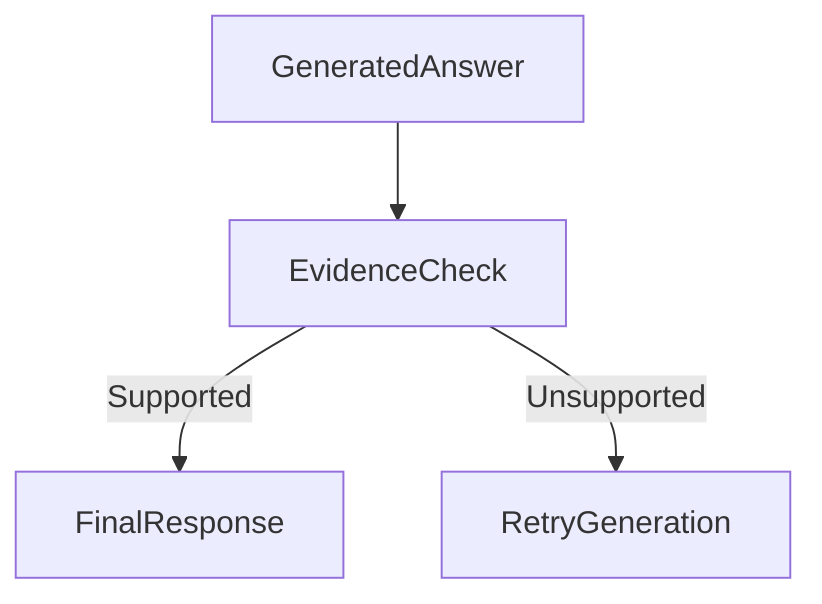

Instead of immediately returning an answer, the graph attempts to ensure factual consistency.

---

# Conversation Flow

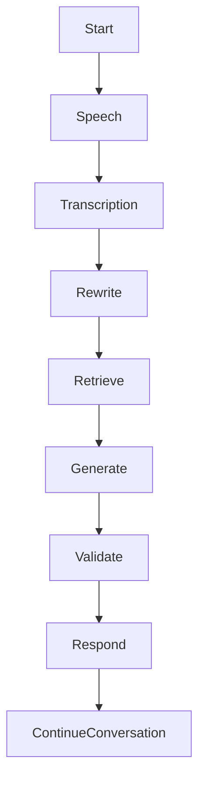

Unlike stateless APIs, every interaction is treated as part of a broader conversational workflow.

---

# Knowledge Ingestion

The retrieval quality depends heavily on document preprocessing.

The ingestion pipeline transforms raw documents into searchable knowledge assets.

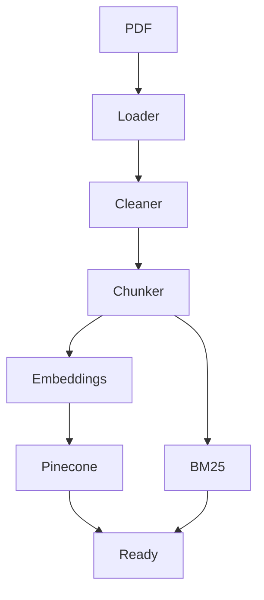

---

# Supported Knowledge Sources

Current repository examples include:

- PDF
- Microsoft Word
- Technical Documentation
- Resume/CV Documents
- Markdown
- Plain Text

The architecture can be extended to support:

- HTML
- Confluence
- SharePoint
- Notion
- Google Docs
- GitHub repositories
- Databases

---

# Environment Variables

Create a `.env` file in the project root.

| Variable | Description |
|------------|-------------|
| `GROQ_API_KEY` | Groq API credentials |
| `PINECONE_API_KEY` | Pinecone API Key |
| `PINECONE_INDEX_NAME` | Pinecone index |
| `LANGCHAIN_API_KEY` | LangSmith API Key |
| `LANGCHAIN_TRACING_V2` | Enable tracing |
| `LANGCHAIN_PROJECT` | LangSmith project name |
| `SECRET_KEY` | Django secret key |
| `DEBUG` | Development mode |
| `ALLOWED_HOSTS` | Django allowed hosts |

---

# Installation

## Clone Repository

```bash
git clone https://github.com/engrmaziz/voice-rag.git

cd voice-rag
```

---

## Create Virtual Environment

```bash
python -m venv venv
```

Windows

```bash
venv\Scripts\activate
```

Linux/macOS

```bash
source venv/bin/activate
```

---

## Install Dependencies

```bash
pip install -r requirements.txt
```

---

## Configure Environment

```bash
cp .env.example .env
```

Update all required environment variables before running the application.

---

## Apply Migrations

```bash
python manage.py migrate
```

---

## Create Administrator

```bash
python manage.py createsuperuser
```

---

## Start Development Server

```bash
python manage.py runserver
```

---

## Run ASGI Server

For WebSocket functionality:

```bash
daphne core.asgi:application
```

---

# Django Management Commands

Typical workflow:

```bash
python manage.py makemigrations

python manage.py migrate

python manage.py createsuperuser

python manage.py collectstatic
```

Future ingestion commands can be integrated into Django's management command framework for automated indexing workflows.

---

# Production Deployment Architecture
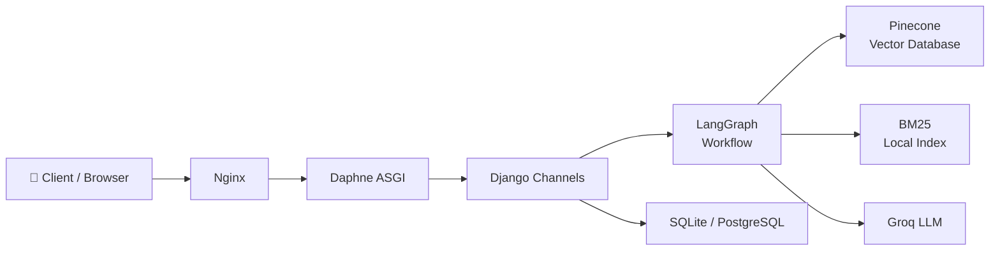

For production deployments, SQLite should typically be replaced with PostgreSQL for improved scalability and concurrency.

---

# Security Considerations

AEGIS Core follows several production-oriented security practices:

- Environment-based secrets
- API key isolation
- ASGI architecture
- Temporary file cleanup
- Modular service boundaries
- Minimal persistent audio storage
- Structured exception handling

Additional recommendations include:

- HTTPS enforcement
- Reverse proxy (Nginx)
- Rate limiting
- JWT authentication
- Secret rotation
- Secure WebSocket configuration
- Regular dependency updates

---

# Performance Optimization

Current optimization techniques include:

- Local embedding model
- Hybrid retrieval
- Cross-encoder reranking
- BM25 serialization
- Async WebSockets
- Stateful orchestration
- Retrieval-first prompting

Potential production enhancements:

- Redis caching
- Celery background workers
- PostgreSQL
- Horizontal ASGI scaling
- Vector cache
- Streaming token responses

---
---

# 🔍 Repository Deep Dive

The project is organized using a modular architecture where each Django application owns a single responsibility. This separation promotes maintainability, extensibility, and testability.

```text
voice-rag
│
├── accounts/         Authentication & User Management
├── chat/             WebSocket Layer & Chat Models
├── core/             Django Configuration
├── documents/        Source Knowledge Documents
├── graph/            LangGraph Workflow Engine
├── knowledge/        Knowledge Ingestion Pipeline
│
├── manage.py
├── requirements.txt
├── bm25_corpus.pkl
└── README.md
```

---

# 📂 Directory Breakdown

## accounts/

Responsible for authentication and user-related functionality.

Typical responsibilities include:

- User models
- Authentication
- Permissions
- Profile extensions
- Admin integration

Future production enhancements may include:

- JWT authentication
- OAuth
- SSO
- RBAC
- Multi-tenancy

---

## chat/

The communication layer.

Contains:

```
chat/

├── consumers.py
├── models.py
├── serializers.py
├── admin.py
└── templates/
```

Responsibilities:

- WebSocket consumers
- Chat persistence
- Response serialization
- Frontend communication
- Real-time message delivery

---

## graph/

The intelligence layer.

```
graph/

build.py
nodes.py
state.py
```

Responsibilities:

- StateGraph construction
- Node implementations
- Conditional routing
- Retry logic
- Graph execution

This package contains the application's business intelligence.

---

## knowledge/

Knowledge processing subsystem.

Responsibilities include:

- Document loading
- PDF parsing
- Text cleaning
- Chunking
- Embedding generation
- Pinecone indexing
- BM25 corpus creation

---

## documents/

Raw knowledge base.

Contains:

- PDFs
- Word documents
- Technical documentation
- Internal guides

These documents become searchable after ingestion.

---

## core/

Django configuration package.

Contains:

```
settings.py

urls.py

asgi.py

wsgi.py
```

Responsibilities:

- Project configuration
- Installed apps
- Middleware
- Routing
- ASGI initialization
- Environment loading

---

# 🧠 LangGraph Workflow

Unlike traditional request-response systems, LangGraph executes a directed state machine.

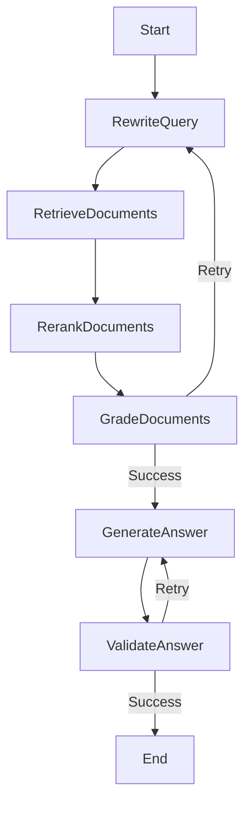

Every node modifies a shared application state.

---

# Node Responsibilities

## Rewrite Node

Purpose:

Improve poorly phrased user questions.

Input:

```
Original Question
```

Output:

```
Optimized Question
```

---

## Retrieval Node

Purpose:

Retrieve candidate knowledge using

- Pinecone

- BM25

Output:

```
Relevant Documents
```

---

## Reranking Node

Purpose:

Improve retrieval precision.

Input:

```
Top-K Documents
```

Output:

```
Highest Quality Documents
```

---

## Grading Node

Purpose:

Evaluate retrieval quality.

Possible outcomes:

```
Relevant

Irrelevant
```

If irrelevant

↓

retry retrieval

---

## Generation Node

Produces grounded responses using

- retrieved context

- prompt templates

- LLM reasoning

---

## Validation Node

Ensures generated answers are supported by retrieved evidence.

This minimizes hallucinations.

---

# 🧾 State Management

Every LangGraph execution shares a common state.

Conceptually:

```python
GraphState

question

rewritten_question

documents

context

response

metadata
```

Each node updates only the fields it owns.

Benefits:

- deterministic execution

- traceability

- reproducibility

- easier debugging

---

# 📊 LangSmith Observability

LangSmith provides complete execution traces.

Each graph execution records:

- prompts
- outputs
- latency
- token usage
- node timings
- execution paths
- retries
- failures

Example execution:

```text
User Question

↓

Rewrite

↓

Retrieve

↓

Rerank

↓

Grade

↓

Generate

↓

Validate

↓

Final Response
```

Every transition becomes observable.

---

# 📝 Logging Strategy

Production deployments should log:

Application

- startup
- shutdown
- configuration

WebSockets

- connect
- disconnect
- errors

LangGraph

- node execution
- retries
- routing decisions

LLM

- latency
- failures
- token usage

Retrieval

- similarity scores
- reranker scores
- retrieved documents

---

# 📈 Monitoring

Recommended production monitoring stack:

Application

- Prometheus

Visualization

- Grafana

Error Tracking

- Sentry

Tracing

- LangSmith

Infrastructure

- Docker Healthchecks

Metrics worth collecting:

- response latency
- websocket count
- retrieval latency
- embedding latency
- Pinecone latency
- LLM latency
- graph execution time
- token consumption

---

# 🧪 Testing Strategy

Testing should be divided into multiple layers.

---

## Unit Tests

Test individual components.

Examples:

- query rewriting

- chunking

- reranking

- graph nodes

- serializers

---

## Integration Tests

Verify communication between components.

Examples:

- Pinecone

- Groq

- LangGraph

- Django Channels

---

## End-to-End Tests

Complete workflow:

```
Speech

↓

Transcription

↓

Retrieval

↓

Generation

↓

Validation

↓

Response
```

---

# 🚀 CI/CD Pipeline

Recommended workflow:
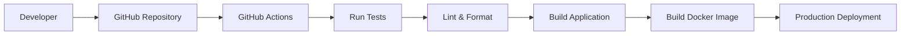

Pipeline stages:

- Lint
- Unit Tests
- Integration Tests
- Build
- Docker Image
- Deploy
- Smoke Tests

---

# 🐳 Docker Deployment

Recommended production stack

```text
Internet

↓

Nginx

↓

Daphne

↓

Django

↓

LangGraph

↓

Pinecone

↓

Groq

↓

PostgreSQL

↓

Redis
```

Optional services:

- Celery
- Flower
- Prometheus
- Grafana

---

# ⚡ Scalability

Horizontal scaling is possible because:

- WebSockets are ASGI-native

- Pinecone is managed

- Groq inference is external

- LangGraph execution is stateless between requests

Recommended additions:

- Redis

- Celery

- PostgreSQL

- Load Balancer

- Kubernetes

---

# 🔒 Security Best Practices

Production deployments should include:

✅ HTTPS

✅ Secure Cookies

✅ CSRF Protection

✅ Secret Rotation

✅ API Rate Limiting

✅ JWT Authentication

✅ WebSocket Authentication

✅ Environment Isolation

✅ Input Validation

✅ Prompt Injection Protection

---

# 📉 Failure Recovery

Potential failures:

Groq unavailable

↓

Retry

Pinecone timeout

↓

Fallback Retrieval

Invalid response

↓

Regenerate

Hallucination

↓

Validation Retry

This layered recovery strategy improves overall reliability.

---

# 📚 Future Enhancements

Planned improvements may include:

- Multi-user conversations
- Conversation memory
- Redis caching
- PostgreSQL migration
- Streaming token responses
- Authentication
- User dashboards
- Admin analytics
- Feedback collection
- Agent tools
- MCP integration
- Multi-agent orchestration
- Knowledge versioning
- Source citation
- Conversation export
- Docker Compose
- Kubernetes manifests
- Terraform deployment
- OpenTelemetry support

---

# 🤝 Contributing

Contributions are welcome.

Recommended workflow:

```text
Fork Repository

↓

Create Feature Branch

↓

Implement Changes

↓

Run Tests

↓

Submit Pull Request
```

Please ensure:

- PEP 8 compliance
- Meaningful commit messages
- Type hints where appropriate
- Clear documentation
- Passing tests

---

# 📄 License

This project is licensed under the **MIT License**.

You are free to:

- use
- modify
- distribute
- commercialize

provided the original license is retained.

See the `LICENSE` file for complete details.

---

# 🙏 Acknowledgements

This project builds upon the incredible work of the open-source AI community.

Special thanks to:

- Django
- Django Channels
- LangChain
- LangGraph
- LangSmith
- Pinecone
- Groq
- Hugging Face
- Sentence Transformers
- OpenAI Whisper
- Microsoft (BM25 research)
- Python Software Foundation

---

# ⭐ Support the Project

If you found this project useful:

- ⭐ Star the repository
- 🍴 Fork the project
- 🐛 Report issues
- 💡 Suggest improvements
- 🤝 Contribute new features

Your support helps improve the project and benefits the broader AI community.

---

<div align="center">

## 🎙️ VoiceRAG Core v1

**Enterprise Voice Retrieval-Augmented Generation Platform**

Built with ❤️ using

**Django • LangGraph • LangChain • LangSmith • Pinecone • Groq • Whisper**

*"Grounded AI through Stateful Orchestration and Hybrid Retrieval."*

</div>
